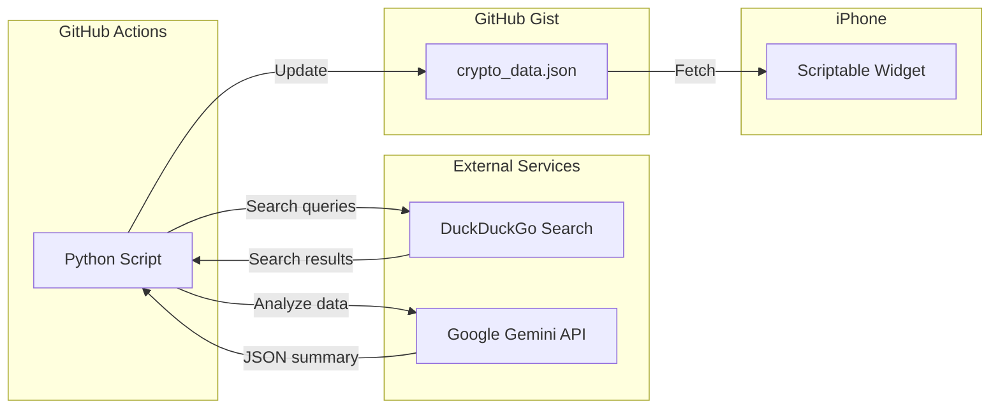

# Crypto Widget - Overview

This is a free crypto market intelligence system. It pulls data from the web, analyzes it with Gemini, and displays it as a widget on my iPhone.

## Architecture



## The stack

I wanted this to be completely free. No recurring costs, no credit card required.

| Component | Service           | Free tier                        |
| --------- | ----------------- | -------------------------------- |
| Scheduler | GitHub Actions    | 2,000 mins/month                 |
| Search    | duckduckgo-search | Unlimited (it's just scraping)   |
| AI        | Google Gemini API | Generous free tier for 1.5 Flash |
| Storage   | GitHub Gist       | Unlimited public gists           |
| Display   | Scriptable        | Free iOS app                     |

## Phases

| Phase | What                              | Status      |
| ----- | --------------------------------- | ----------- |
| 1     | Backend (Python + GitHub Actions) | Not started |
| 2     | Widget (Scriptable)               | Not started |
| 3     | Testing and deployment            | Not started |

## What it outputs

The Python script produces a JSON file with this structure:

```json
{
  "btc_price": "$95,XXX",
  "eth_price": "$3,XXX",
  "bias": "BULLISH | BEARISH | NEUTRAL",
  "bias_color": "#00FF00 | #FF0000 | #FFFF00",
  "summary": "Market driver summary...",
  "support": "BTC Support: $XX,XXX",
  "resistance": "BTC Res: $XX,XXX",
  "updated": "HH:MM UTC"
}
```

The widget reads this JSON and renders it on the home screen.
