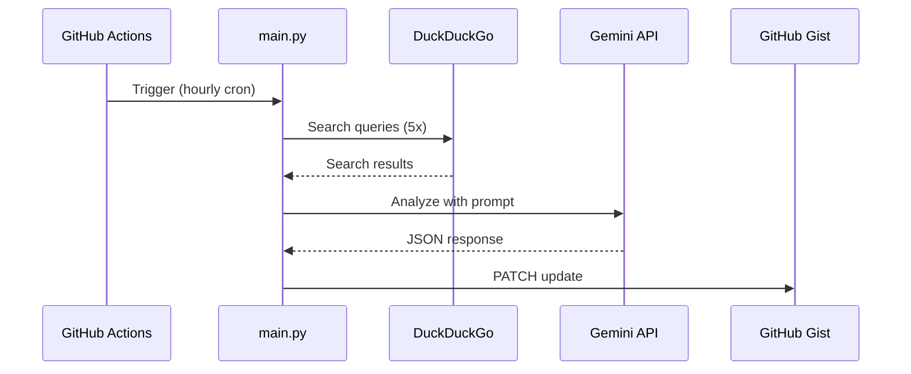

# Phase 1: Backend

This is the Python script that does all the work. It runs on GitHub Actions, searches the web, asks Gemini to analyze the results, and saves everything to a Gist.

---

## How it works



---

## The search queries

The script runs these searches:

| Query                                              | Why                      |
| -------------------------------------------------- | ------------------------ |
| `Bitcoin price today usd`                          | Get current BTC price    |
| `Ethereum price today usd`                         | Get current ETH price    |
| `latest crypto news geopolitics fed rate`          | What's moving the market |
| `crypto fear and greed index today`                | Sentiment                |
| `bitcoin support resistance levels analysis today` | Technical levels         |

It grabs the top 3 results from each, so 15 results total.

---

## The analysis

The script sends all those search results to Gemini 1.5 Flash with a prompt that tells it to act as a crypto analyst and output structured JSON.

The output looks like:

```json
{
  "btc_price": "$95,XXX",
  "eth_price": "$3,XXX",
  "bias": "BULLISH",
  "bias_color": "#00FF00",
  "summary": "One sentence on what's driving the market",
  "support": "BTC Support: $XX,XXX",
  "resistance": "BTC Res: $XX,XXX",
  "updated": "HH:MM UTC"
}
```

---

## main.py

````python
import os
import json
import requests
import google.generativeai as genai
from duckduckgo_search import DDGS
from datetime import datetime

# Setup
GENAI_KEY = os.environ["GEMINI_API_KEY"]
GIST_TOKEN = os.environ["GIST_TOKEN"]
GIST_ID = os.environ["GIST_ID"]

genai.configure(api_key=GENAI_KEY)

def get_market_data():
    queries = [
        "Bitcoin price today usd",
        "Ethereum price today usd",
        "latest crypto news geopolitics fed rate",
        "crypto fear and greed index today",
        "bitcoin support resistance levels analysis today"
    ]

    results = []
    with DDGS() as ddgs:
        for q in queries:
            r = list(ddgs.text(q, max_results=3))
            results.extend(r)
    return str(results)

def analyze_market(search_data):
    model = genai.GenerativeModel('gemini-1.5-flash')

    prompt = f"""
    Role: Senior Crypto Analyst.
    Task: Analyze these search results and output a strictly valid JSON object.

    Search Data: {search_data}

    Output Format (JSON only, no markdown blocks):
    {{
        "btc_price": "$95,XXX",
        "eth_price": "$3,XXX",
        "bias": "BULLISH" | "BEARISH" | "NEUTRAL",
        "bias_color": "#00FF00" (if bullish) | "#FF0000" (if bearish) | "#FFFF00" (if neutral),
        "summary": "One sentence summary of the market driver (e.g. 'Fed rate pause likely, driving risk-on flows').",
        "support": "BTC Support: $XX,XXX",
        "resistance": "BTC Res: $XX,XXX",
        "updated": "HH:MM UTC"
    }}
    """

    response = model.generate_content(prompt)
    clean_json = response.text.replace('```json', '').replace('```', '').strip()
    return json.loads(clean_json)

def update_gist(data):
    headers = {"Authorization": f"token {GIST_TOKEN}"}
    payload = {
        "files": {
            "crypto_data.json": {
                "content": json.dumps(data, indent=2)
            }
        }
    }
    requests.patch(f"https://api.github.com/gists/{GIST_ID}", json=payload, headers=headers)

if __name__ == "__main__":
    print("Starting analysis...")
    raw_data = get_market_data()
    print("Data fetched. Analyzing...")
    json_output = analyze_market(raw_data)
    json_output["updated"] = datetime.utcnow().strftime("%H:%M UTC")
    print("Analysis complete. Updating Gist...")
    update_gist(json_output)
    print("Done!")
````

---

## GitHub Action

Create this file at `.github/workflows/daily_update.yml`:

```yaml
name: Hourly Crypto Update

on:
  schedule:
    - cron: "0 * * * *" # Every hour at minute 0
  workflow_dispatch: # Manual trigger button

jobs:
  build:
    runs-on: ubuntu-latest
    steps:
      - uses: actions/checkout@v3

      - name: Set up Python
        uses: actions/setup-python@v4
        with:
          python-version: "3.9"

      - name: Install Dependencies
        run: |
          pip install google-generativeai duckduckgo-search requests

      - name: Run Script
        env:
          GEMINI_API_KEY: ${{ secrets.GEMINI_API_KEY }}
          GIST_TOKEN: ${{ secrets.GIST_TOKEN }}
          GIST_ID: ${{ secrets.GIST_ID }}
        run: python main.py
```

---

## Cron schedule options

| Frequency                  | Cron           |
| -------------------------- | -------------- |
| Every hour                 | `0 * * * *`    |
| Every 30 mins              | `*/30 * * * *` |
| Every 6 hours              | `0 */6 * * *`  |
| Once a day at midnight UTC | `0 0 * * *`    |

Keep in mind: GitHub Actions free tier gives you 2,000 minutes per month. Hourly runs = ~720 runs/month. As long as each run is under 2-3 minutes, you're fine.

---

## Things that can go wrong

| Error                    | Cause                          | Fix                                        |
| ------------------------ | ------------------------------ | ------------------------------------------ |
| DDG rate limit           | Too many searches too fast     | Add delays, or reduce queries              |
| Gemini quota exceeded    | Hit free tier limit            | Check usage in Google AI Studio            |
| Invalid JSON from Gemini | Model didn't follow the format | Add retry logic or validate before parsing |
| Gist auth failure        | Token expired                  | Regenerate your PAT                        |

---

## Testing locally

```bash
export GEMINI_API_KEY="your-key"
export GIST_TOKEN="your-token"
export GIST_ID="your-gist-id"

pip install google-generativeai duckduckgo-search requests

python main.py
```
