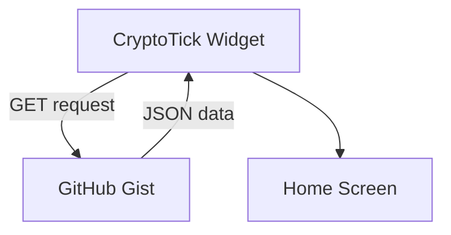

# Phase 2: iPhone Widget

This is the Scriptable code that displays the data on my home screen.

---

## How it works

The widget just fetches JSON from the Gist and displays it. Super simple.



---

## What it looks like

```
+---------------------------------------------+
| BULLISH                          14:30 UTC  |
|                                             |
| BTC: $96,420                                |
| ETH: $3,250                                 |
|                                             |
| Fed rate pause likely, driving risk-on...  |
+---------------------------------------------+
```

---

## Widget code

```javascript
// Replace this with your actual Raw Gist URL
const url =
  "https://gist.githubusercontent.com/YOUR_USERNAME/YOUR_GIST_ID/raw/crypto_data.json";

const widget = await createWidget();
if (!config.runsInWidget) {
  await widget.presentMedium();
}
Script.setWidget(widget);
Script.complete();

async function createWidget() {
  const req = new Request(url);
  const data = await req.loadJSON();

  const w = new ListWidget();
  w.backgroundColor = new Color("#1C1C1E");

  // Header row: bias on left, time on right
  let headerStack = w.addStack();
  let biasText = headerStack.addText(data.bias);
  biasText.font = Font.blackSystemFont(16);
  biasText.textColor = new Color(data.bias_color);
  headerStack.addSpacer();
  let timeText = headerStack.addText(data.updated);
  timeText.font = Font.systemFont(10);
  timeText.textColor = Color.gray();

  w.addSpacer(8);

  // BTC price
  let btcStack = w.addStack();
  let btcLabel = btcStack.addText("BTC: " + data.btc_price);
  btcLabel.font = Font.boldSystemFont(18);
  btcLabel.textColor = Color.white();

  w.addSpacer(2);

  // ETH price
  let ethStack = w.addStack();
  let ethLabel = ethStack.addText("ETH: " + data.eth_price);
  ethLabel.font = Font.boldSystemFont(18);
  ethLabel.textColor = Color.lightGray();

  w.addSpacer(8);

  // Summary
  let summaryText = w.addText(data.summary);
  summaryText.font = Font.systemFont(12);
  summaryText.textColor = Color.white();
  summaryText.minimumScaleFactor = 0.7;

  return w;
}
```

---

## Getting your Raw Gist URL

The URL format is:

```
https://gist.githubusercontent.com/USERNAME/GIST_ID/raw/crypto_data.json
```

To find it:

1. Go to your Gist page
2. Click "Raw" on the JSON file
3. Copy the URL from your browser

If the URL has a commit hash in it, you can remove it. Just using `/raw/crypto_data.json` at the end will always get the latest version.

---

## Small widget version

If you want a more compact widget that just shows BTC:

```javascript
async function createWidget() {
  const req = new Request(url);
  const data = await req.loadJSON();

  const w = new ListWidget();
  w.backgroundColor = new Color("#1C1C1E");

  let biasText = w.addText(data.bias);
  biasText.font = Font.blackSystemFont(14);
  biasText.textColor = new Color(data.bias_color);
  biasText.centerAlignText();

  w.addSpacer(4);

  let btcLabel = w.addText(data.btc_price);
  btcLabel.font = Font.boldSystemFont(22);
  btcLabel.textColor = Color.white();
  btcLabel.centerAlignText();

  w.addSpacer(4);

  let timeText = w.addText(data.updated);
  timeText.font = Font.systemFont(10);
  timeText.textColor = Color.gray();
  timeText.centerAlignText();

  return w;
}
```

---

## Adding support/resistance levels

If you want to show the technical levels, add this after the ETH section:

```javascript
w.addSpacer(4);

let supStack = w.addStack();
let supLabel = supStack.addText(data.support);
supLabel.font = Font.systemFont(11);
supLabel.textColor = new Color("#4CAF50");

w.addSpacer(1);

let resStack = w.addStack();
let resLabel = resStack.addText(data.resistance);
resLabel.font = Font.systemFont(11);
resLabel.textColor = new Color("#F44336");
```

---

## Making the widget tappable

Add this before `return w;` to open a site when you tap the widget:

```javascript
w.url = "https://www.coingecko.com/";
```

---

## Colors and fonts

Current setup:

| Element    | Value               |
| ---------- | ------------------- |
| Background | #1C1C1E (dark gray) |
| Bullish    | #00FF00 (green)     |
| Bearish    | #FF0000 (red)       |
| Neutral    | #FFFF00 (yellow)    |
| BTC price  | White               |
| ETH price  | Light gray          |

---

## Adding to home screen

1. Long press on home screen
2. Tap +
3. Search "Scriptable"
4. Pick medium size
5. Add it
6. Tap the widget, select CryptoTick

---

## Troubleshooting

| Problem            | Likely cause                                           |
| ------------------ | ------------------------------------------------------ |
| "Unable to load"   | Wrong URL                                              |
| Data is old        | Backend isn't running, or cache issue                  |
| Layout looks wrong | JSON structure changed                                 |
| Widget is blank    | Run the script in Scriptable directly to see the error |
